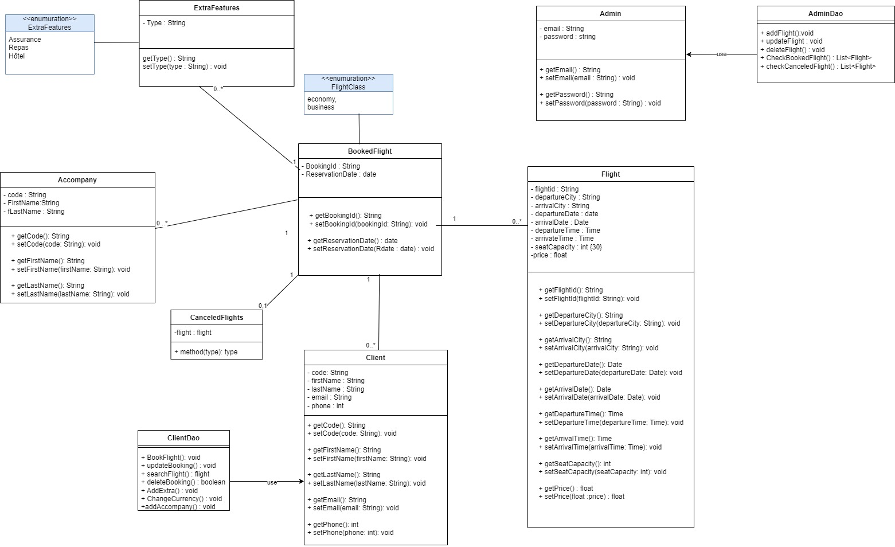

## Air Africa

#### In the pursuit of automating their flight reservation system, AirAfrika aims to develop a responsive web application enabling customers to book flights through their website. Customers can search for flights, view flight proposals, make reservations, and pay online. Additional features include baggage management, a loyalty program, and a strict cancellation policy. The system also allows administrators to manage flights and provides detailed statistics.

### diagram de class :

